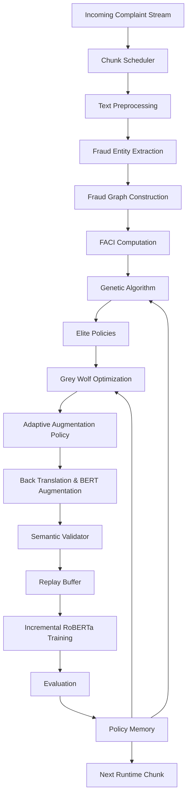
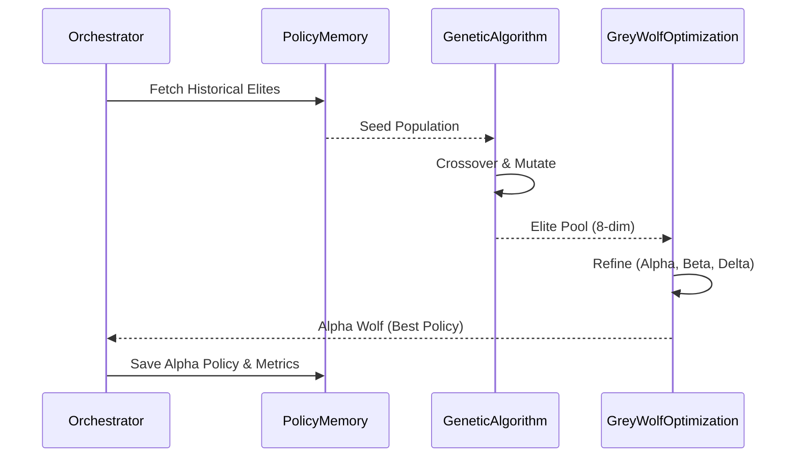

# System Architecture

## Runtime Processing Pipeline

```mermaid
graph TD;
    A[Incoming Complaint Stream] --> B[Chunk Scheduler]
    B --> C[Text Preprocessing]
    C --> D[Fraud Entity Extraction]
    D --> E[Fraud Graph Construction]
    E --> F[FACI Computation]
    F --> G[Genetic Algorithm]
    G --> H[Elite Policies]
    H --> I[Grey Wolf Optimization]
    I --> J[Adaptive Augmentation Policy]
    J --> K[Back Translation & BERT Augmentation]
    K --> L[Semantic Validator]
    L --> M[Replay Buffer]
    M --> N[Incremental RoBERTa Training]
    N --> O[Evaluation]
    O --> P[Policy Memory]
    P --> G
    P --> I
    P --> Q[Next Runtime Chunk]
```

## Hybrid Optimization Pipeline

```mermaid
sequenceDiagram
    participant Orchestrator
    participant PolicyMemory
    participant GeneticAlgorithm
    participant GreyWolfOptimization
    
    Orchestrator->>PolicyMemory: Fetch Historical Elites
    PolicyMemory-->>GeneticAlgorithm: Seed Population
    GeneticAlgorithm->>GeneticAlgorithm: Crossover & Mutate
    GeneticAlgorithm-->>GreyWolfOptimization: Elite Pool (8-dim)
    GreyWolfOptimization->>GreyWolfOptimization: Refine (Alpha, Beta, Delta)
    GreyWolfOptimization-->>Orchestrator: Alpha Wolf (Best Policy)
    Orchestrator->>PolicyMemory: Save Alpha Policy & Metrics
```
